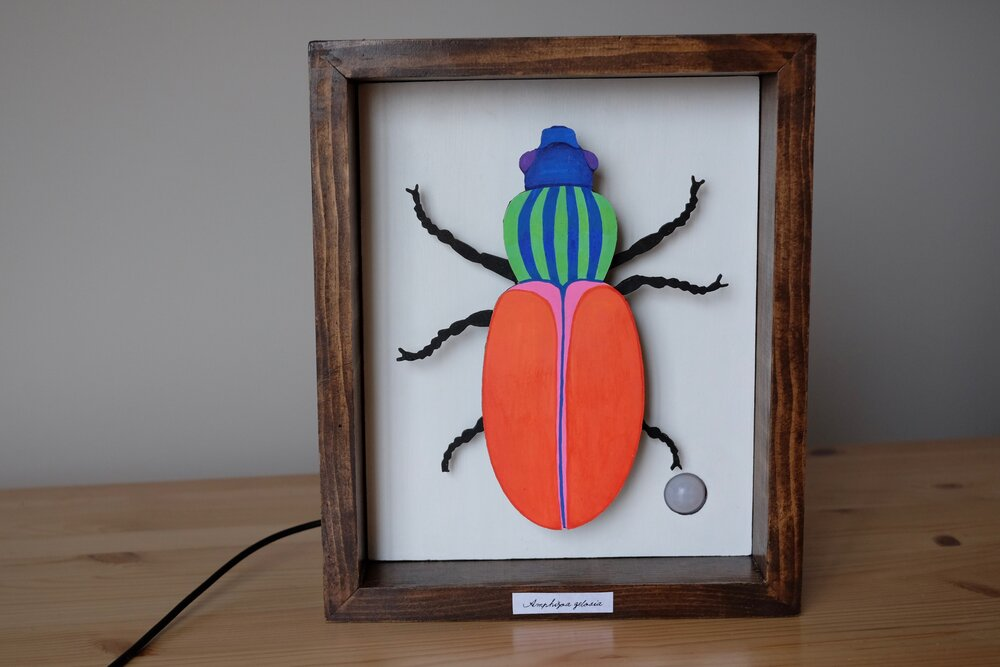
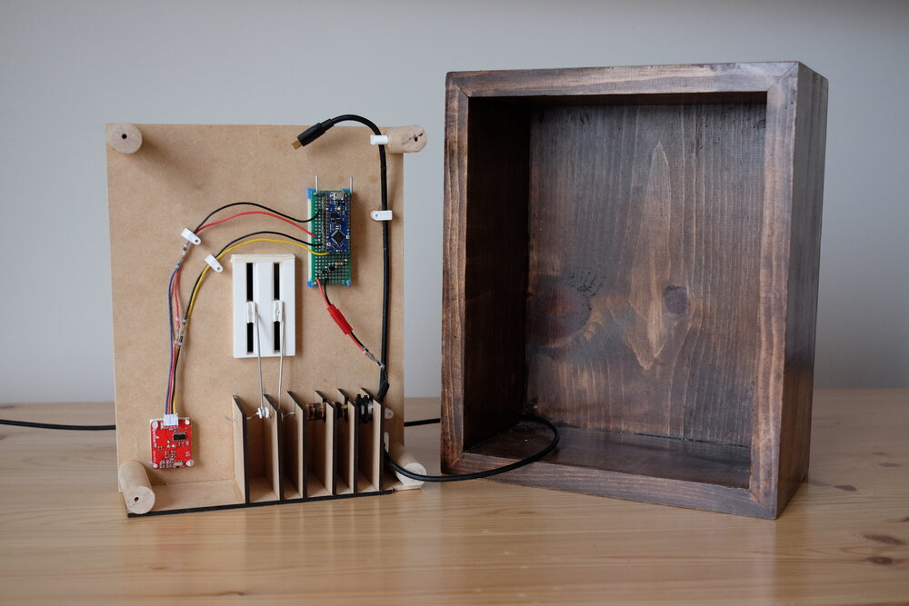

# Amphizoa gelosia

*Amphizoa gelosia* is an interactive taxidermy beetle that wiggles when a viewer approaches. Hidden inside its frame is an Arduino, a DC micro motor, and a passive infrared sensor.

In 2020, the piece was part of The Box Show at [Gallery Route One](https://galleryrouteone.org/) in Point Reyes Station, California. It was exhibited from August to September, and proceeds from the purchase were contributed to the gallery's annual fundraiser.

[Watch video](https://youtu.be/wlvblIysOCE)
